# Forum App — CI Testing

[](https://github.com/CarpinetiOctavio/forum-app-ci-testing/actions/workflows/ci.yml)
[](LICENSE)

**Author:** Octavio Carpineti
**Course:** Software Engineering III — Universidad Católica de Córdoba (UCC)
**Year:** 2025

This is the first repository in a three-part series, each one adding exactly one
layer of complexity on top of a foundation that is already fundamented and
closed: **forum-app-ci-testing** (this repo) → [forum-app-qa-pipeline](https://github.com/CarpinetiOctavio/forum-app-qa-pipeline) → [forum-app-cloud-deploy](https://github.com/CarpinetiOctavio/forum-app-cloud-deploy).

---

## Table of Contents

1. [Why This Repository Exists](#why-this-repository-exists)
2. [Scope — What This Repo Does and Deliberately Does Not Do](#scope--what-this-repo-does-and-deliberately-does-not-do)
3. [App Description](#app-description)
4. [Pipeline & Testing](#pipeline--testing)
5. [Tech Stack](#tech-stack)
6. [Prerequisites](#prerequisites)
7. [Installation](#installation)
8. [Running the Project](#running-the-project)
9. [Running Tests](#running-tests)
10. [Project Structure](#project-structure)
11. [Documentation Approach](#documentation-approach)
12. [Troubleshooting](#troubleshooting)
13. [Metrics](#metrics)

---

## Why This Repository Exists

The first thing worth asking about this series is not what each repository
does — it's why the same forum app is spread across three of them instead of
being built once. A single repository could have accumulated unit tests,
coverage gates, static analysis, and a full deployment pipeline in one pass. It
didn't, on purpose.

**At the level of the series:** each repository adds exactly one layer of
complexity on top of a foundation that is already fundamented and closed
before the next layer starts. `forum-app-qa-pipeline` does not get written
until the testing discipline established here is complete and justified on its
own terms. `forum-app-cloud-deploy` does not touch Docker or deployment until
the coverage and quality gates in `qa-pipeline` are settled. Collapsing that
into one repository would erase the evidence that each layer was a deliberate
decision rather than a byproduct of momentum — and that evidence, not the
pipeline mechanics, is what this series exists to show. A recruiter reading
three repositories in sequence is meant to see the same question answered
three times, at increasing scope: *what does this layer need, and why does it
stop exactly here?*

**At the level of this repository:** this is where that pattern is declared
for the first time. Before any pipeline can be extended with coverage
thresholds, static analysis, containers, or cloud deployment, there has to be
a working, deliberately-scoped foundation of unit testing and CI automation
that stands on its own reasoning — not one inherited from a course example,
and not one borrowed from a later, more complex repository in this same
series (see [ADR-000](docs/decisions/ADR-000-resolving-forward-not-mirroring-backward.md)).
Every decision recorded in [`docs/decisions/`](docs/decisions/) here is
grounded independently in software engineering fundamentals or in this
repository's own scope — never in "the next repo already solved this." If this
foundation isn't sound on its own terms, nothing built on top of it in
`qa-pipeline` or `cloud-deploy` has a real base to stand on.

---

## Scope — What This Repo Does and Deliberately Does Not Do

This repository automates unit testing for a Go backend and a React frontend
with GitHub Actions, scoped specifically to the **Services layer** — the only
layer in this application that holds business rules and validation logic
worth discriminating with a unit test. `Repository` (SQL execution),
`Handlers` (HTTP translation), and most frontend components are deliberately
untested at the unit level here — not because they were skipped, but because
none of them branch on a business rule the way `AuthService` and
`PostService` do. See
[ADR-002](docs/decisions/ADR-002-testing-scope-services-layer.md) for the full
reasoning behind exactly which units earned a unit test and which didn't.

The pipeline runs both test suites on every push and pull request, reports
coverage as a downloadable artifact, and enforces **no minimum coverage
threshold**. That is not an oversight — a coverage gate is the declared
responsibility of `forum-app-qa-pipeline`, the next repository in this series.
Adding one here would silently absorb a decision that belongs to that repo,
and would erase the reason `qa-pipeline` needs to exist at all. See
[ADR-004](docs/decisions/ADR-004-ci-pipeline-design.md) for the pipeline's full
design, including a coverage-measurement bug found and fixed during this
project's own documentation review.

---

## App Description

The application under test is a small forum: users register and log in,
create and delete posts, and comment on posts — with one enforced business
rule running through both layers: only the author of a post or comment may
delete it. The app itself is the context for the testing problem this repo
solves, not the point of the repo.

---

## Pipeline & Testing

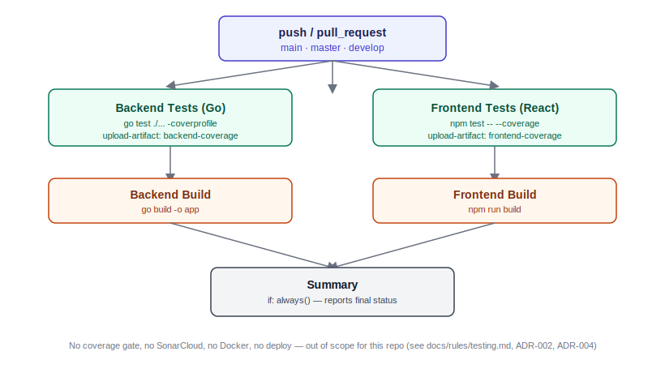

The diagram shows the actual structure of `.github/workflows/ci.yml`: backend
and frontend tests run in parallel, each gates its own build job, and a final
summary job reports overall status — with no coverage gate and no external
reporting service (see [ADR-004](docs/decisions/ADR-004-ci-pipeline-design.md)).

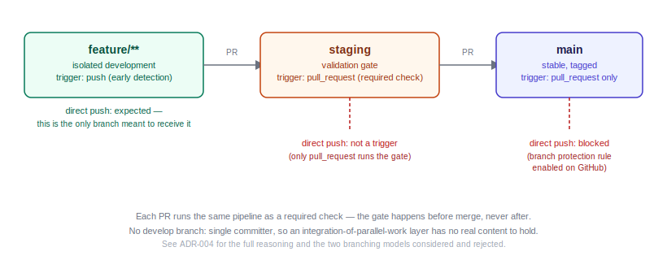

The pipeline runs as a required check on pull requests into `staging` and
`main` — so a failing gate blocks a merge instead of being discovered after
the fact. Direct push to either branch is blocked by branch protection rules.
See [ADR-004](docs/decisions/ADR-004-ci-pipeline-design.md) for why this model
replaced the original push-to-main trigger.

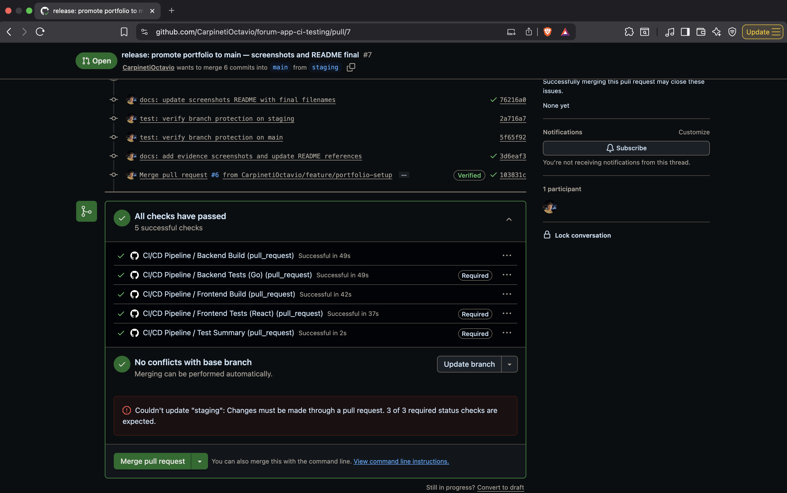

*All five jobs green on the PR staging→main — evidence that the pipeline runs
as a preventive gate, not post-hoc verification.*

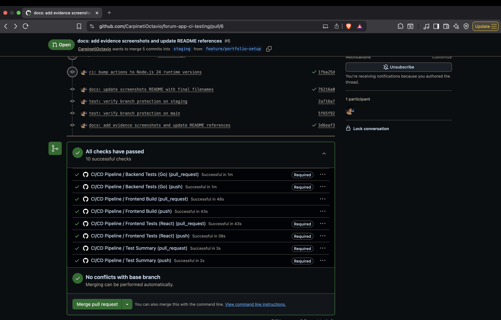

*Merging blocked on staging until required checks pass — the gate enforced
before code reaches any shared branch.*

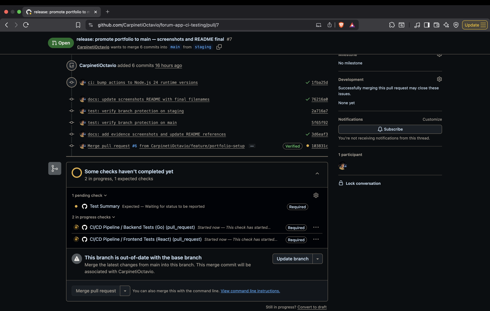

*Same gate on main — nothing reaches the stable branch without passing the
full pipeline.*

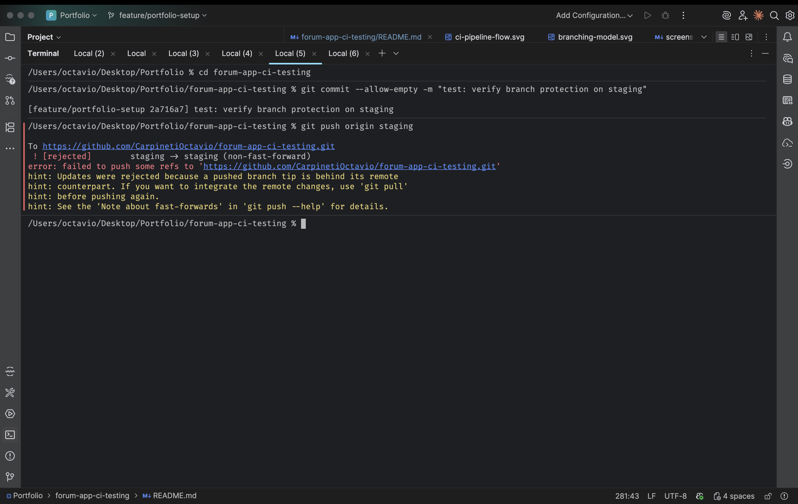

*Terminal output showing a direct push to staging rejected by GitHub —
evidence the policy is enforced at the protocol level, not just in the UI.*

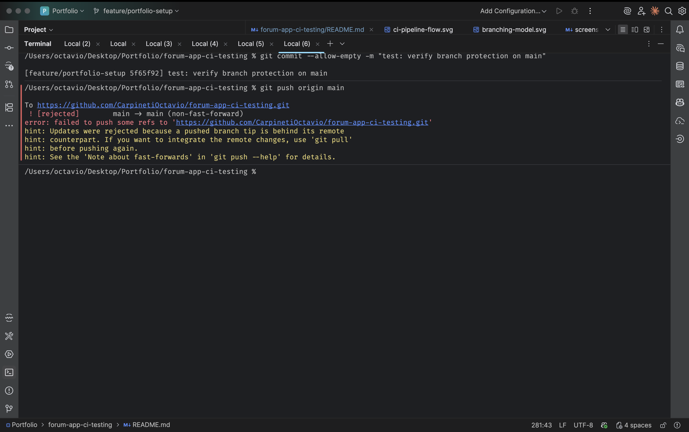

*Same rejection for a direct push to main.*

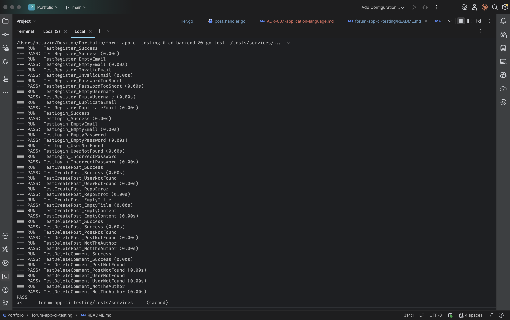

*Terminal output of `go test ./tests/services/... -v` — 23/23 passing.*

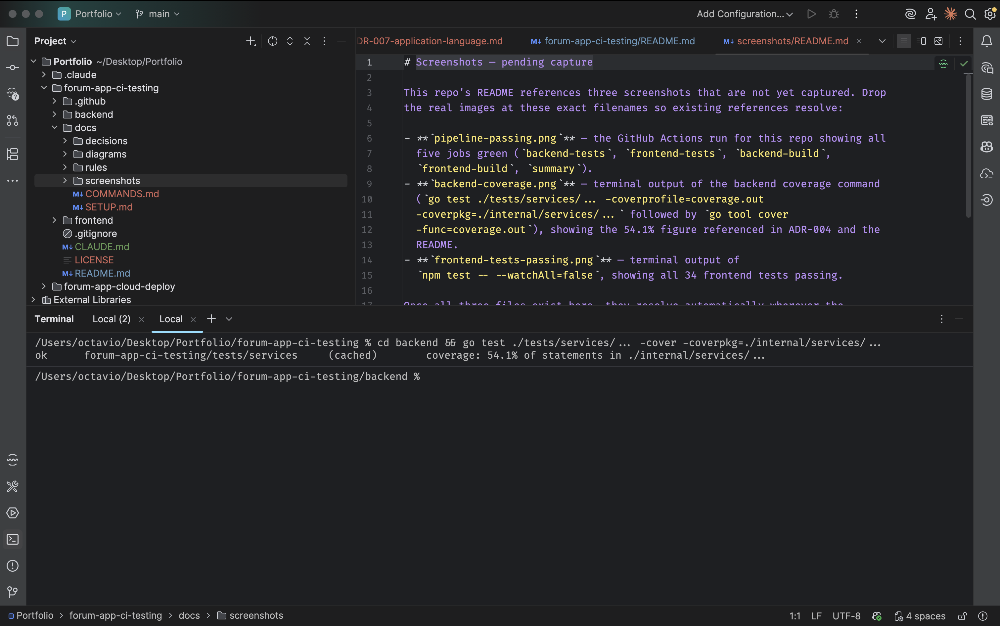

*Terminal output showing 54.1% coverage measured against `internal/services`
— the declared scope of this repo (see ADR-002).*

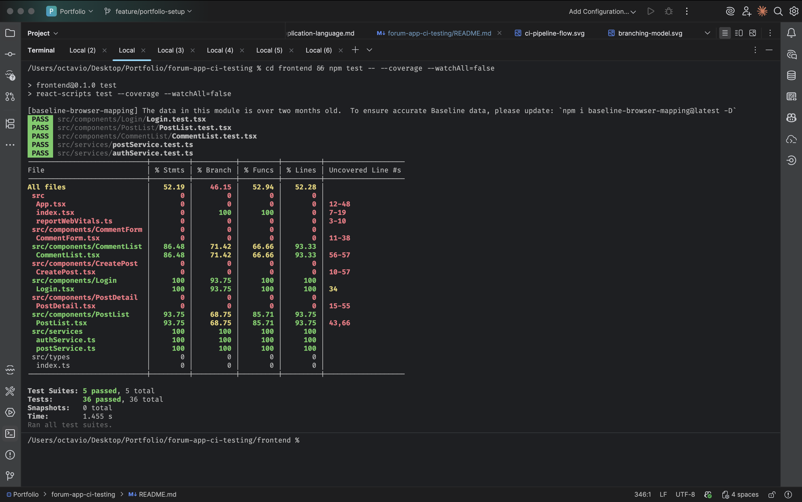

*Terminal output of `npm test -- --coverage --watchAll=false` — 36/36
passing across 5 suites.*

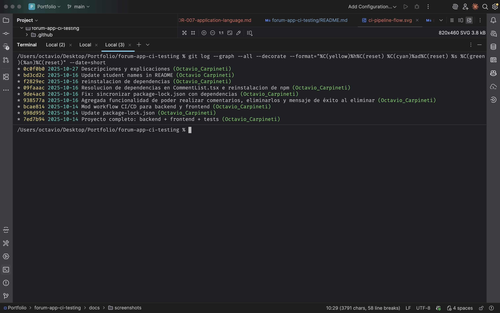

*Linear commit history on main before the branching model was adopted —
all commits on a single line, no branches.*


*Full branch tree after adopting feature→staging→main, with merge commits
from all PRs visible.*

---

## Tech Stack

| Layer | Technology |
|-------|------------|
| Backend | Go 1.24 + SQLite |
| Frontend | React 19 + TypeScript |
| Backend testing | Go `testing` + testify (assert + mock) |
| Frontend testing | Jest + React Testing Library |
| CI/CD | GitHub Actions |

---

## Prerequisites

```bash
go version     # 1.24 or higher
node --version # 18 or higher
npm --version
```

This repository needs no external infrastructure — no cloud account, no
container registry, no secrets. Full setup detail, including why that's true,
is in [`docs/SETUP.md`](docs/SETUP.md).

---

## Installation

```bash
git clone https://github.com/CarpinetiOctavio/forum-app-ci-testing.git
cd forum-app-ci-testing

cd backend && go mod download && cd ..
cd frontend && npm install && cd ..
```

---

## Running the Project

```bash
# Terminal 1 — backend
cd backend && go run cmd/api/main.go
# http://localhost:8080

# Terminal 2 — frontend
cd frontend && npm start
# http://localhost:3000
```

---

## Running Tests

```bash
# Backend
cd backend
go test ./tests/services/... -v -cover -coverpkg=./internal/services/...
# 23/23 pass, 54.1% coverage

# Frontend
cd frontend
npm test -- --coverage --watchAll=false
# 34/34 pass
```

54.1% is measured exclusively against `internal/services` — the entire
declared testing scope of this repository, not a partial view of it. See
[ADR-002](docs/decisions/ADR-002-testing-scope-services-layer.md) for why that
scope excludes `Repository` and `Handlers`.

The full command reference — including single-test runs, HTML coverage
reports, and three manual checks that verify the mocking strategy actually
isolates tests from the database and the network — is in
[`docs/COMMANDS.md`](docs/COMMANDS.md).

---

## Project Structure

```
forum-app-ci-testing/
├── .github/
│   └── workflows/
│       └── ci.yml                       # CI/CD pipeline (see ADR-004)
├── backend/
│   ├── cmd/api/main.go                  # Server entry point
│   ├── internal/
│   │   ├── database/                    # SQLite schema and connection
│   │   ├── handlers/                    # HTTP handlers — not unit-tested (ADR-002)
│   │   ├── models/                      # Data structures
│   │   ├── repository/                  # Data access — not unit-tested (ADR-002)
│   │   ├── router/                      # Route configuration
│   │   └── services/                    # Business logic — the tested layer
│   ├── tests/
│   │   ├── mocks/                       # Repository test doubles
│   │   └── services/                    # 23 unit tests
│   ├── go.mod
│   └── go.sum
├── frontend/
│   ├── src/
│   │   ├── components/                  # Login, PostList, CommentList tested;
│   │   │                                #   CreatePost, CommentForm, PostDetail not (ADR-002)
│   │   ├── services/                    # authService (5 tests) + postService (14 tests)
│   │   └── __mocks__/axios.ts           # HTTP test double
│   └── package.json
├── docs/
│   ├── decisions/                       # ADR-000 through ADR-007
│   ├── diagrams/ci-pipeline-flow.svg
│   ├── screenshots/                     # 10 evidence screenshots (pipeline, branch protection, coverage, git history)
│   ├── rules/                           # AI assistant operating rules
│   ├── SETUP.md
│   └── COMMANDS.md
├── CLAUDE.md                            # AI assistant operating context
├── LICENSE
└── README.md
```

---

## Documentation Approach

This project was developed with Claude (Anthropic) as an AI assistant, under
an explicit constraint: Claude acts as a conceptual auditor and writing
assistant — never as the decision-maker for test design, mocking strategy, or
scope boundaries. Every design decision recorded in this repository was made
by Octavio Carpineti; Claude's role was surfacing inconsistencies, grounding
proposed resolutions in software engineering fundamentals, and drafting the
documentation itself for review. `CLAUDE.md` states this constraint explicitly
and defines the initialization protocol any assistant session follows before
touching a file.

`docs/decisions/` holds eight ADRs, each grounded independently rather than
copied from a later repository in this series (see
[ADR-000](docs/decisions/ADR-000-resolving-forward-not-mirroring-backward.md)):

| ADR | Covers |
|---|---|
| [000](docs/decisions/ADR-000-resolving-forward-not-mirroring-backward.md) | Why this repo's decisions are grounded independently, never mirrored from `cloud-deploy` |
| [001](docs/decisions/ADR-001-stack-choice.md) | Why Go + React over the course's .NET/Angular example |
| [002](docs/decisions/ADR-002-testing-scope-services-layer.md) | Why only the Services layer is unit-tested |
| [003](docs/decisions/ADR-003-mocking-strategy.md) | Why Repository and axios are mocked, and nothing else is |
| [004](docs/decisions/ADR-004-ci-pipeline-design.md) | CI pipeline design: trigger, coverage as artifact, no gate — plus a coverage-measurement bug found and fixed |
| [005](docs/decisions/ADR-005-package-lock-incident.md) | A `package-lock.json` desync incident, reconstructed from git history |
| [006](docs/decisions/ADR-006-test-name-translation.md) | Why test names were translated to English, and why that differs from `cloud-deploy`'s equivalent decision |
| [007](docs/decisions/ADR-007-application-language.md) | Why the application's own UI text and error messages are in English, not just its documentation |

`docs/rules/` defines the operating rules an assistant follows in this
repository — what's in scope, what naming and testing conventions apply, and
what requires explicit approval before being written.

---

## Troubleshooting

**`npm ci` fails in CI with a lockfile mismatch:**
see [ADR-005](docs/decisions/ADR-005-package-lock-incident.md) and
[`docs/COMMANDS.md`](docs/COMMANDS.md#troubleshooting) for the fix.

**Backend won't start (port in use), frontend dependencies are stale, or
backend tests fail after a fresh clone:** all three are documented with the
exact commands in [`docs/COMMANDS.md`](docs/COMMANDS.md#troubleshooting).

---

## Metrics

| Metric | Result             | Notes |
|--------|--------------------|-------|
| Backend unit tests | 23/23              | AuthService (11) + PostService (12) |
| Frontend unit tests | 36/36              | authService (5) + postService (14) + Login (7) + PostList (7) + CommentList (5) |
| Total tests | 59                 | — |
| Backend coverage | 54.1%              | `internal/services` only — 100% of declared scope (see [ADR-002](docs/decisions/ADR-002-testing-scope-services-layer.md)) |
| Frontend coverage | 52.19% (all files) | Files outside declared scope included in this aggregate; tested files individually: 86–100% (see [ADR-002](docs/decisions/ADR-002-testing-scope-services-layer.md)) |

---

**Author:** Octavio Carpineti
**GitHub:** https://github.com/CarpinetiOctavio
**Repository:** https://github.com/CarpinetiOctavio/forum-app-ci-testing

The next step in this series is [forum-app-qa-pipeline](https://github.com/CarpinetiOctavio/forum-app-qa-pipeline), which builds on this foundation by adding static analysis, a coverage gate, and end-to-end tests — none of which belong here, and all of which depend on this base being solid first.
